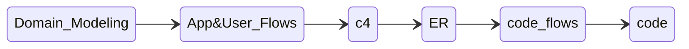
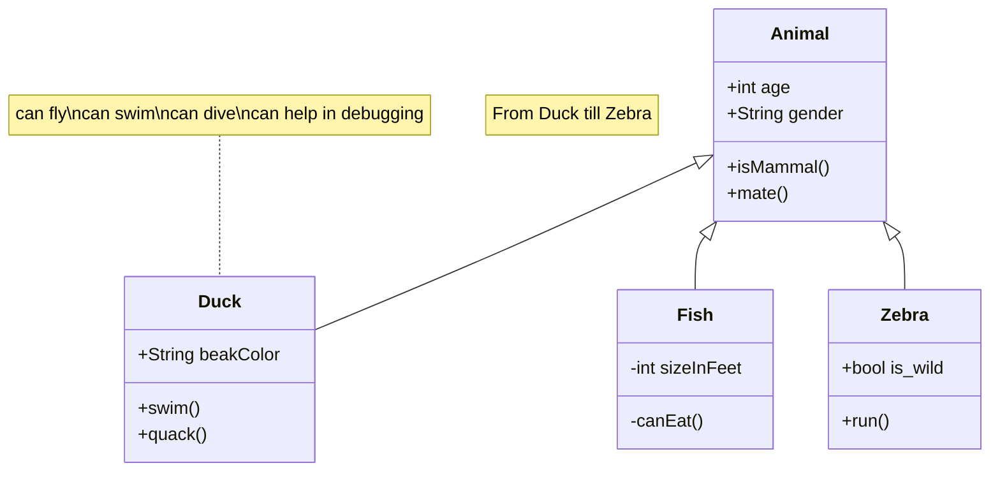
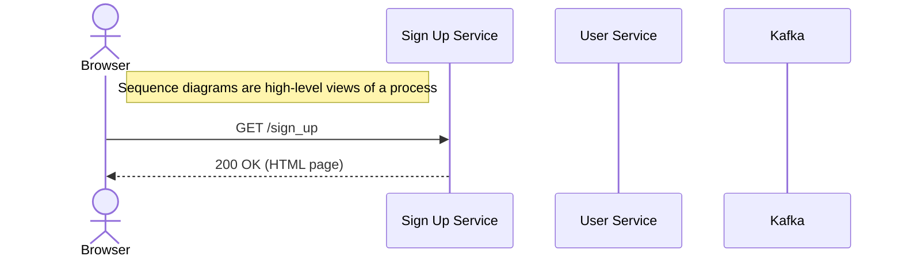
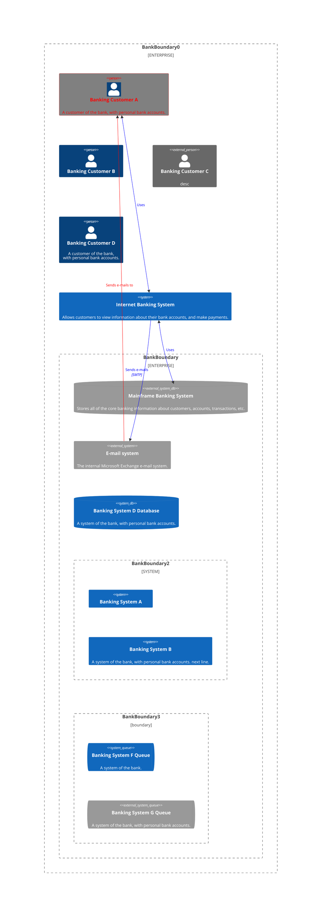
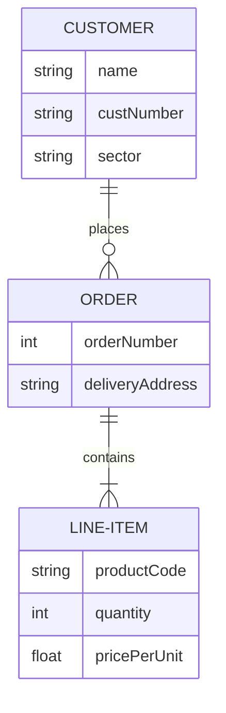
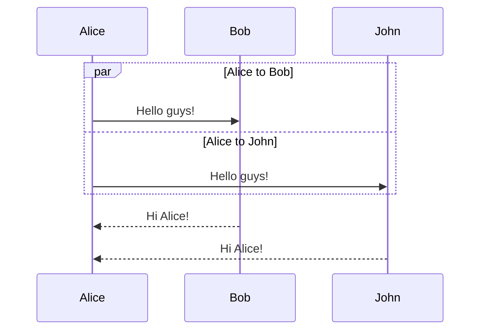

# Document your design using mermaid

- [Document your design using mermaid](#document-your-design-using-mermaid)
  - [Document your Domain](#document-your-domain)
  - [Visualize Application and User Flows](#visualize-application-and-user-flows)
  - [Model your architecture using C4 model](#model-your-architecture-using-c4-model)
  - [Design database schema using erDiagram](#design-database-schema-using-erdiagram)
  - [Visualize code flows using sequence diagrams](#visualize-code-flows-using-sequence-diagrams)
  - [Design and refactor your application using class diagram(code level)](#design-and-refactor-your-application-using-class-diagramcode-level)

## Document your Domain

- use classDiagram
- decide relationships between entities (association, composition, aggregation) 

    |  Association | Composition  | Aggregation  |
    |---|---|---|
    | There’s no owner of the relationship though, and they can exist completely independently of one another  | There’s an owner of the relationship, but if the parent is deleted, the child can still remain  | Similarly to aggregations, there’s an owner of the relationship. However, if the parent is deleted, the child must be deleted, too  |
- Define Inheritance/ Interfaces

## Visualize Application and User Flows

- create sequence diagrams to
  - define actor models
  - define interactions
  - alternate paths and branching logics
  - annotate diagrams with sequence numbers

## Model your architecture using C4 model

- create context diagram
- create container diagram with clear system boundaries (using sub graphs)
- strucuture component diagrams (optional, should be joint responsibility of dev lead)
- structure code diagrams (optional, should be primary responsibilities of lead/devs)

## Design database schema using erDiagram

- When writing an architecture decision record (ADR) for a brand-new service, you may optionally include an ERD to show a snapshot of the database design at that point in time
- Add 
  - enrity relationships (like zero to many etc)
  - enrich schema with keys
  - comment your columns

## Visualize code flows using sequence diagrams

## Design and refactor your application using class diagram(code level)

- component/module level class diagram
- refactor using SOLID